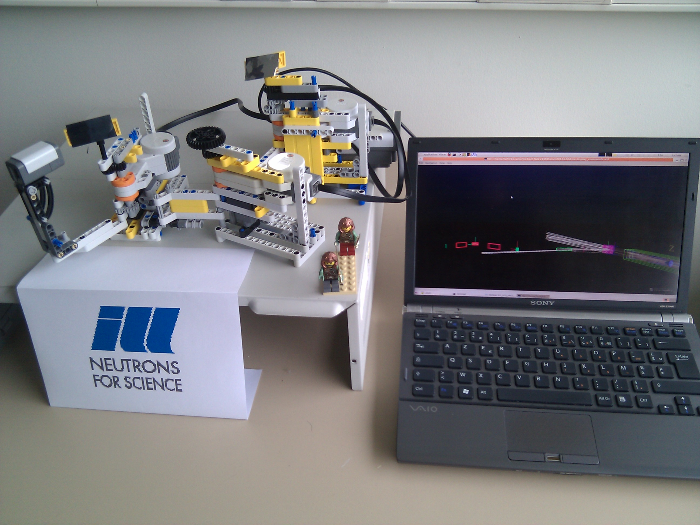

# mcstas-lego

TAS and TOF neutron scattering spectrometers connected with a Lego NXT MindStorms model

This is a set of McStas components and instruments to model a Triple-Axis and a Time-Of-Flight neutron scattering instruments, connected with a [Lego MindStorms](https://en.wikipedia.org/wiki/Lego_Mindstorms_NXT) real-world model. 

This is a robotic model (it moves) to be used for teaching/training and in exhibitions. When a McStas simulation is launched on the PC, the model positions itself with the corresponding geometry. 

Table of contents:
- [Documentation](doc)
- [McStas files](model)
- [Lego parts](parts)
- [Software](tools)

## Installation

1. Install [t2n](https://www-verimag.imag.fr/~raymond/home/tools/t2n/). On Debian-class systems (Ubuntu, Mint...) just use `sudo apt install t2n`.
2. Install [NBC](tools/nbc-1.2.1.r3.src.tgz) with `cd nbc-1.23.r3.src; sudo make install`.
3. Compile the TAS and TOF nxc code: `nbc -EF nxTAS.nxc -O=nxTAS.rxe`.
4. Connect the Lego MindStorms controller NXT via USB and initiate communication with `t2n -i`.
5. Send the program to the NXT with `t2n -put nxTAS.rxe` or `nbc -EF -d nxTAS.nxc`.
6. Start the program on the NXT in _My Files>Software Files_.
7. Build the Lego model.
7. Compile the McStas `.instr`, and use it.

----
This is (c) E. Farhi and Jean-Philippe Panaget, 2011.
